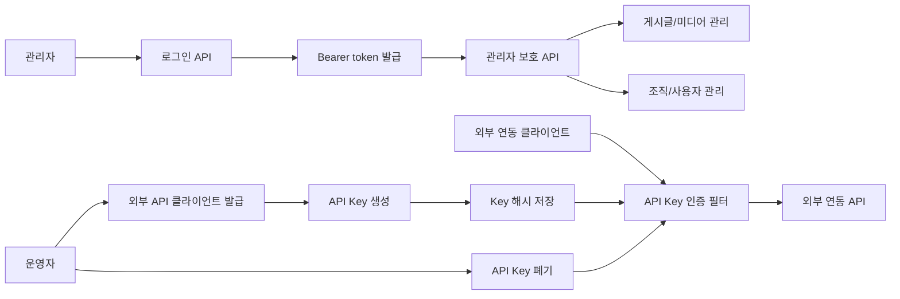

# castleCms 프로젝트 요약

## 세 줄 요약

- `castleCms`는 콘텐츠, 미디어, 조직/사용자, 외부 API 클라이언트를 관리하는 운영형 CMS 개인 프로젝트입니다.
- 소스 저장소는 비공개로 관리하고, 공개 자료에는 화면 흐름, API/권한/데이터 모델, 검증 기준만 정리합니다.
- 요구사항 정의부터 구조 설계, 구현, 테스트, 화면 QA까지 연결한 풀스택 사례입니다.

## 프로젝트 한 문장

`castleCms`는 Next.js 관리자 화면과 Spring Boot API를 기반으로 게시글, 미디어, 조직, 사용자, 외부 API Key 클라이언트를 운영자가 관리할 수 있게 만든 풀스택 CMS입니다.

## 왜 만들었나

실무에서 관리자 도구, 결제/정산, CRM, 외부 연동을 다룰 때 핵심은 단순 CRUD보다 운영 권한과 데이터 흐름을 분명히 나누는 것입니다.

`castleCms`는 이 경험을 개인 프로젝트 요구사항으로 옮겨 다음 문제를 다룹니다.

- 콘텐츠와 미디어가 흩어져 있을 때 운영자가 상태를 추적하기 어렵다.
- 조직과 사용자 권한이 분리되지 않으면 데이터 접근 범위가 불분명해진다.
- 외부 API 클라이언트의 발급, 폐기, 인증 흐름이 없으면 연동 수명주기를 관리하기 어렵다.
- 관리자 화면, API 계약, 데이터 모델, 테스트 기준이 따로 움직이면 기능 검증이 느슨해진다.

## 설명 가능한 구조

### Frontend

- Next.js와 React 기반 관리자 화면
- 로그인, 게시글/미디어, 조직/사용자, 외부 API 클라이언트 관리 화면 구성
- API 응답 상태와 운영자가 보는 목록/상세/수정 흐름을 기준으로 화면을 나눔
- 공개 포트폴리오에는 주요 화면 스크린샷을 제공

### Backend

- Spring Boot 기반 REST API
- Spring Security로 관리자 인증과 보호 API 구성
- JPA 기반 도메인 모델과 Flyway 기반 마이그레이션 관리
- 게시글, 미디어, 조직, 사용자, 외부 API 클라이언트 도메인 분리

### 권한과 인증

- 관리자 로그인 후 Bearer token 기반으로 보호 API 접근
- 조직과 사용자 데이터를 분리해 조직 범위의 관리 흐름을 설명할 수 있게 구성
- 외부 API 클라이언트는 API Key 발급, 해시 저장, 폐기, 인증 필터 흐름으로 관리

### 권한 흐름 다이어그램

기술 설명에서는 관리자 인증과 외부 클라이언트 인증을 분리했다는 점을 먼저 다룹니다. 내부 운영 화면은 Bearer token으로 보호하고, 외부 연동 주체는 API Key 발급/해시 저장/폐기 흐름으로 별도 수명주기를 갖게 했다고 설명합니다.

### 데이터 모델 관점

- 게시글: 임시저장, 발행, 제목, SEO, 대표 이미지, 본문 HTML 같은 콘텐츠 운영 필드 중심
- 미디어: 게시글과 연결될 수 있는 이미지/파일 관리 흐름 중심
- 조직/사용자: 운영 주체와 접근 범위 분리
- API 클라이언트: 외부 연동 주체, key 상태, 폐기 여부, 인증 흐름 관리

## 구현 포인트

1. 운영형 관리자 도구의 기능 경계와 화면 흐름을 먼저 정의했습니다.
2. 요구사항, API 계약, 권한 흐름, 데이터 모델, 테스트 기준을 함께 맞췄습니다.
3. 전체 소스 대신 주요 화면과 구조 설명으로 설계 의도와 구현 범위를 공개합니다.
4. Cursor와 Codex는 요구사항 분해, 반복 구현, 테스트 보강에 사용했고 최종 판단은 빌드, 테스트, 화면 QA 기준으로 검증했습니다.
5. 아직 실제 운영 지표는 없으므로 성과 숫자 대신 검증 범위와 남은 개선 범위를 함께 정리합니다.

## 기술 설명 기준

### 왜 CMS를 만들었나요?

운영자가 다루는 데이터는 게시글 하나보다 권한, 상태, 외부 연동까지 함께 움직입니다. 실무에서 관리자 포털과 운영 데이터를 다룬 경험을 개인 프로젝트로 재구성해, 화면과 API와 권한을 끝까지 연결해보고 싶었습니다.

### 공개 범위와 검증 방식

공개 포트폴리오에는 로그인, 게시글/미디어 관리, 조직/사용자 관리, 외부 API 클라이언트 관리 화면을 스크린샷으로 제공합니다. 일반 공개 자료에서는 구조와 검증 기준을 중심으로 정리하고, 소스 리뷰가 필요한 상황에서는 별도 범위로 대응합니다.

### AI 도구는 어디까지 사용했나요?

요구사항을 기능 단위로 쪼개고 반복 구현과 테스트 보강 속도를 높이는 데 사용했습니다. 다만 API 계약, 권한 흐름, 데이터 모델, 빌드 결과, 테스트 결과, 브라우저 화면 확인은 직접 판단했습니다.

### 가장 중요한 설계 포인트는 무엇인가요?

관리자 인증과 외부 API Key 인증을 구분한 점입니다. 내부 운영자는 Bearer token 기반으로 보호 API를 사용하고, 외부 연동 주체는 API Key 발급/폐기와 인증 필터를 통해 별도 수명주기로 관리합니다.

### 남은 개선 범위

실제 운영 트래픽, 감사 로그, 세부 권한 매트릭스, 파일 저장소 정책, 장애 대응 지표는 아직 부족합니다. 대신 개인 프로젝트 범위에서는 기능 경계, 인증/권한 흐름, 데이터 모델, 테스트와 빌드 검증까지 닫는 것을 목표로 했습니다.

## 공개 자료

- 로그인 화면
- 게시글과 미디어 관리 화면
- 조직과 사용자 관리 화면
- 외부 API 클라이언트 관리 화면
- 프로젝트 카드의 문제, 역할, 설계/구현, 검증, AI 활용 설명
- `docs/project-briefs/castlecms-api-brief.md`의 API 흐름과 요청/응답 예시
- Jest, JUnit, 빌드, 브라우저 QA 기준의 검증 흐름

## 검증 범위

| 구분 | 검증 대상 | 설명할 수 있는 의미 |
| --- | --- | --- |
| 단위 테스트 | 화면 렌더링, 프로젝트 카드 문구, 데이터 표시 | 공개 포트폴리오에서 의도한 설명이 깨지지 않게 확인 |
| Backend 테스트 | 인증, 도메인 로직, API 흐름 | 보호 API와 주요 도메인 동작을 코드 레벨에서 확인 |
| 빌드 검증 | Next.js, Spring Boot 빌드 | 프론트와 백엔드가 각각 배포 가능한 상태인지 확인 |
| 화면 QA | 로그인, 게시글/미디어, 조직/사용자, 외부 API 클라이언트 화면 | 실제 운영자가 보는 흐름 기준으로 기능을 점검 |
